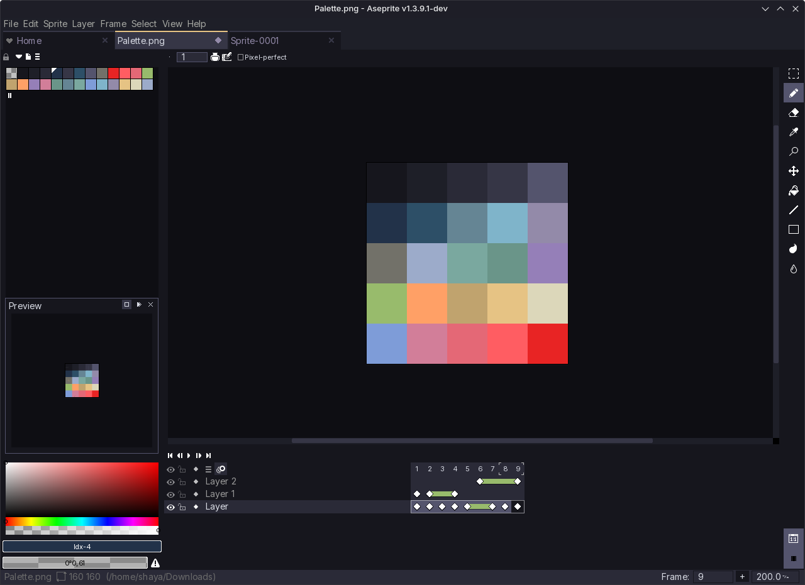

  <h2 align="center">🌊 KANAGAWA.aseprite 🌊</h2>

Aseprite dark colorscheme inspired by the colors of the famous painting by Katsushika Hokusai.

Based on [Dark Mort HD](https://mortmort.itch.io/aseprite-darkmode) by MortMort. Hugely inspired by [kanagawa.nvim](https://github.com/rebelot/kanagawa.nvim) by rebelot. 

## Installation
- Download [latest release](https://github.com/shayaharuno/kanagawa.aseprite/releases/tag/stable)
- Open Aseprite extensions (Edit-Preferences-Extensions) and select kanagawa-theme.extension-aseprite
- Select Kanagawa Theme. Use 100% UI and Screen scale
